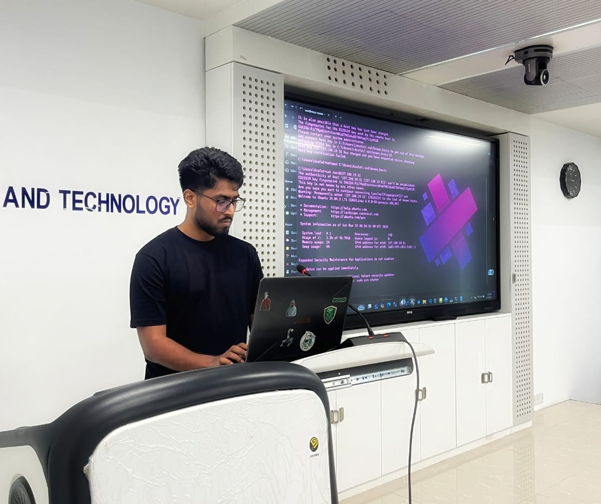

# Arafat Portfolio - Cybersecurity Engineer & Developer

<div align="center">
  
  <p><em>Application Security Engineer | Cybersecurity Expert | Web Developer</em></p>
</div>

## 🚀 Overview

A modern, interactive portfolio website with a unique hacker-inspired design theme. This project showcases my skills, projects, and professional experience in cybersecurity, web development, and entrepreneurship.

The site features a dark, terminal-inspired UI with interactive elements, animations, and sound effects that create an engaging user experience while maintaining professional aesthetics.

## ✨ Features

### 🎨 Design & UI

- **Hacker-Inspired Theme**: Dark interface with neon green accents and terminal-style elements
- **Interactive Profile**: Click-activated profile with glitch effects and dynamic information display
- **Responsive Layout**: Fully responsive design that works seamlessly across all devices
- **Custom Animations**: Subtle animations including typing effects, scan lines, and digital noise
- **Sound Effects**: Optional click sounds for enhanced interactivity

### 📱 Core Sections

- **Dashboard**: Main hub with profile information, social links, and navigation
- **Skills Page**: Interactive display of technical skills with filterable categories
- **Projects Gallery**: Showcase of development and security projects with detailed information
- **Blog Section**: Articles and insights with categorization and reading time estimates
- **Contact Form**: Self-hosted email solution for direct communication

### 🛠️ Technical Features

- **Modern Stack**: Built with Next.js 15, React 18, TypeScript, and Tailwind CSS
- **Performance Optimized**: Fast loading times with optimized assets and code splitting
- **Accessibility Focused**: Semantic HTML and proper contrast ratios for better accessibility
- **SEO Friendly**: Structured metadata, Open Graph tags, and optimized content
- **Self-Hosted**: No dependency on third-party portfolio services

## 🔧 Technology Stack

- **Framework**: [Next.js 15](https://nextjs.org/)
- **Language**: [TypeScript](https://www.typescriptlang.org/)
- **Styling**: [Tailwind CSS](https://tailwindcss.com/)
- **UI Components**: [shadcn/ui](https://ui.shadcn.com/) with Radix UI
- **Icons**: [Lucide React](https://lucide.dev/)
- **Animations**: Custom CSS animations and [Framer Motion](https://www.framer.com/motion/)
- **Form Handling**: [React Hook Form](https://react-hook-form.com/) with [Zod](https://zod.dev/) validation
- **Email**: Self-hosted SMTP solution

## 🚀 Getting Started

### Prerequisites

- Node.js 18.18.0 or higher
- pnpm (recommended) or npm

### Installation

1. Clone the repository

   ```bash
   git clone https://github.com/yourusername/arafat-portfolio.git
   cd arafat-portfolio
   ```

2. Install dependencies

   ```bash
   pnpm install
   # or
   npm install
   ```

3. Run the development server

   ```bash
   pnpm dev
   # or
   npm run dev
   ```

4. Open [http://localhost:3000](http://localhost:3000) in your browser

### Building for Production

```bash
pnpm build
# or
npm run build
```

## 📂 Project Structure

```
arafat-portfolio/
├── app/                  # Next.js App Router
│   ├── about/            # About page
│   ├── blog/             # Blog section
│   ├── contact/          # Contact page
│   ├── dashboard/        # Main dashboard
│   ├── projects/         # Projects showcase
│   ├── skills/           # Skills page
│   ├── globals.css       # Global styles
│   └── layout.tsx        # Root layout
├── components/           # Reusable components
├── data/                 # JSON data files (skills, projects)
├── lib/                  # Utility functions
├── public/               # Static assets
│   └── images/           # Image files
├── styles/               # Additional styles
└── utils/                # Helper functions
```

## 🎨 Customization

The portfolio is designed to be easily customizable:

- **Theme**: Edit colors in `tailwind.config.ts` and `app/globals.css`
- **Content**: Update personal information in data files
- **Skills**: Modify `data/skills.json` to reflect your expertise
- **Projects**: Edit project information in the projects section
- **Animations**: Adjust animation parameters in CSS files

## 🌐 Deployment

This portfolio can be deployed to various platforms:

- [Vercel](https://vercel.com/) (recommended for Next.js)
- [Netlify](https://www.netlify.com/)
- [GitHub Pages](https://pages.github.com/)
- Any static hosting service

## 📝 License

This project is open source and available under the [MIT License](LICENSE).

## 🙏 Acknowledgements

- [Next.js](https://nextjs.org/) for the React framework
- [Tailwind CSS](https://tailwindcss.com/) for styling
- [shadcn/ui](https://ui.shadcn.com/) for UI components
- [Lucide](https://lucide.dev/) for icons
- All other open-source libraries used in this project

## 📧 Contact

Easin Arafat - [e4rafat@gmail.com](mailto:e4rafat@gmail.com)

Project Link: [https://github.com/yourusername/arafat-portfolio](https://github.com/yourusername/arafat-portfolio)

---

<div align="center">
  <p>Designed & Developed with ❤️ by Easin Arafat</p>
</div>
